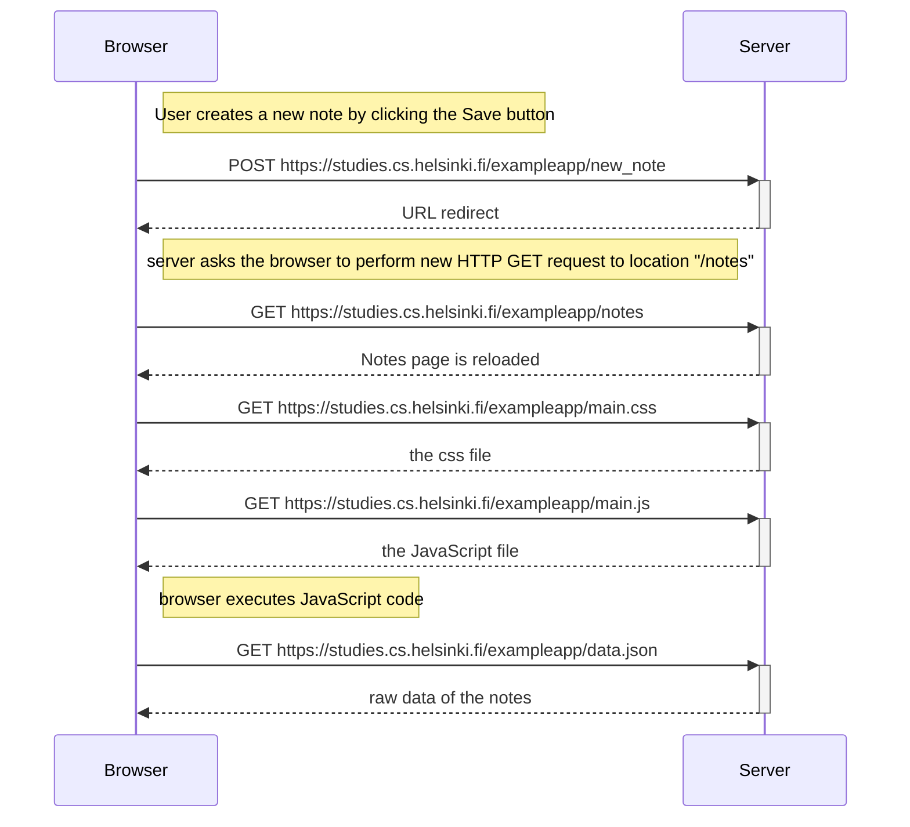

## New Note Diagram

```mermaid
sequenceDiagram
    Note right of Browser: User creates a new note by clicking the Save button
    Browser->>+Server: POST https://studies.cs.helsinki.fi/exampleapp/new_note
    Server-->>-Browser: URL redirect
    Note right of Browser: server asks the browser to perform new HTTP GET request to location "/notes" 
    Browser->>+Server: GET https://studies.cs.helsinki.fi/exampleapp/notes
    Server-->>-Browser: Notes page is reloaded
    Browser->>+Server: GET https://studies.cs.helsinki.fi/exampleapp/main.css
    Server-->>-Browser: the css file
    Browser->>+Server: GET https://studies.cs.helsinki.fi/exampleapp/main.js
    Server-->>-Browser: the JavaScript file
    Note right of Browser: browser executes JavaScript code
    Browser->>+Server: GET https://studies.cs.helsinki.fi/exampleapp/data.json
    Server-->>-Browser: raw data of the notes
```
