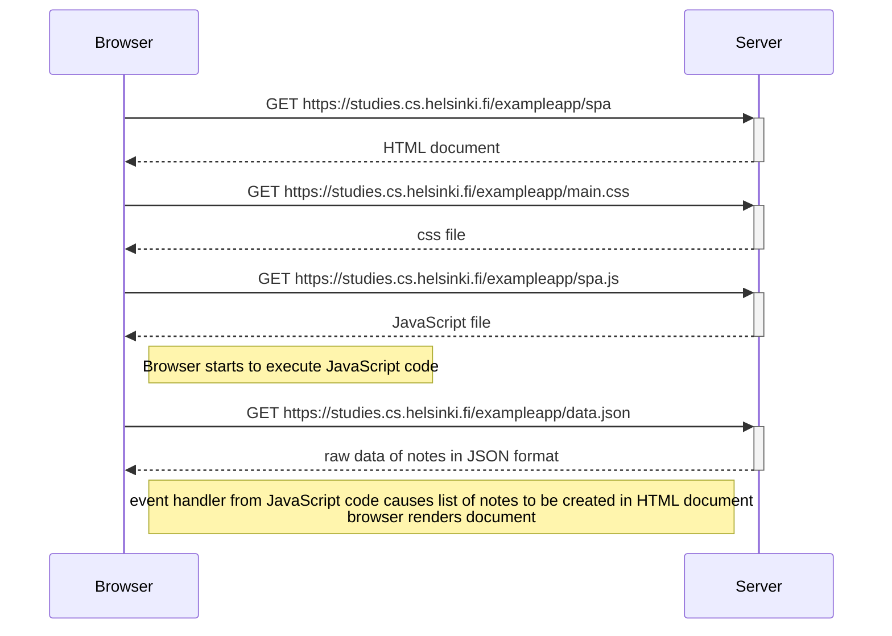

## Single Page App Diagram

```mermaid
sequenceDiagram
    Browser->>+Server: GET https://studies.cs.helsinki.fi/exampleapp/spa
    Server-->>-Browser: HTML document
    Browser->>+Server: GET https://studies.cs.helsinki.fi/exampleapp/main.css
    Server-->>-Browser: css file
    Browser->>+Server: GET https://studies.cs.helsinki.fi/exampleapp/spa.js
    Server-->>-Browser: JavaScript file
    note right of Browser: Browser starts to execute JavaScript code
    Browser->>+Server: GET https://studies.cs.helsinki.fi/exampleapp/data.json
    Server-->>-Browser: raw data of notes in JSON format
    note right of Browser: event handler from JavaScript code causes list of notes to be created in HTML document<br/>browser renders document
```
